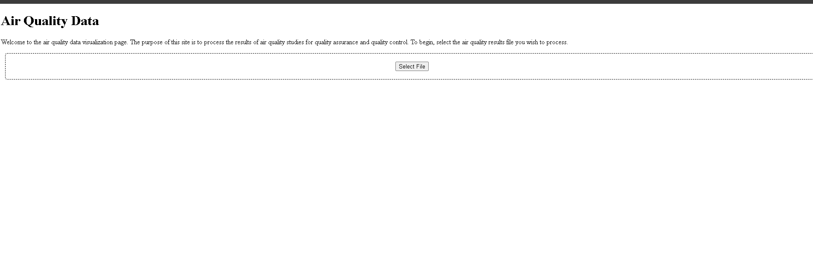
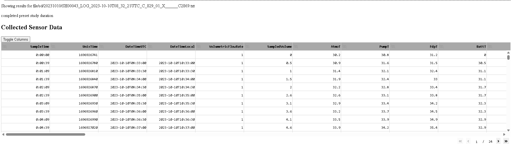
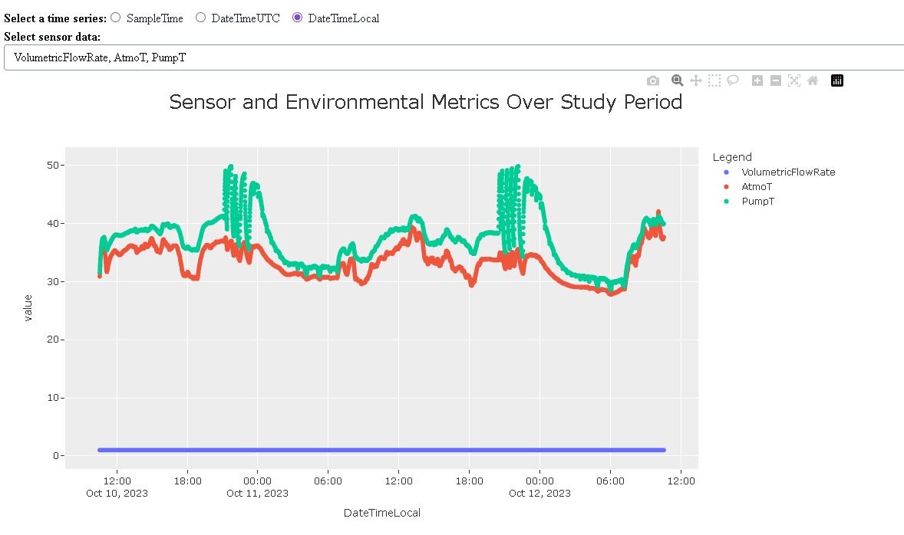
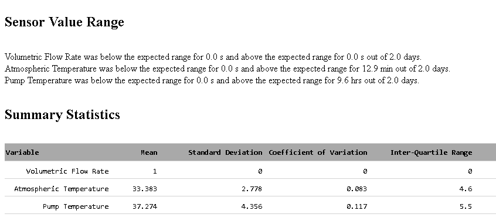
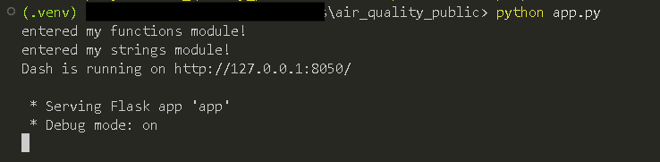
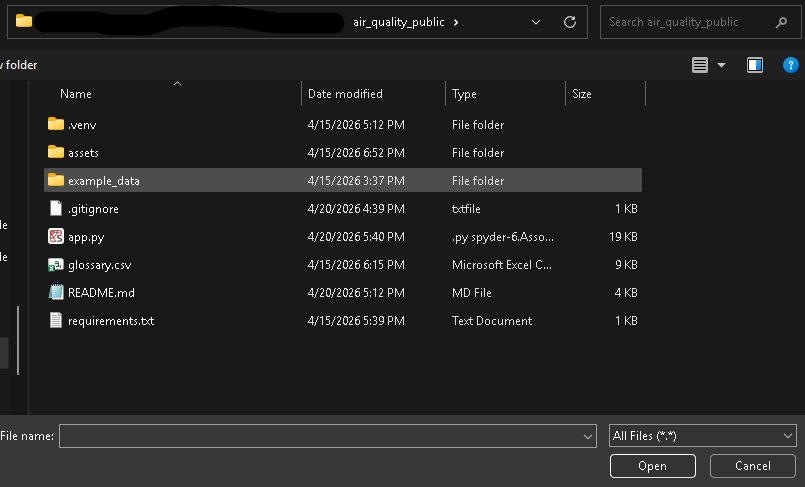
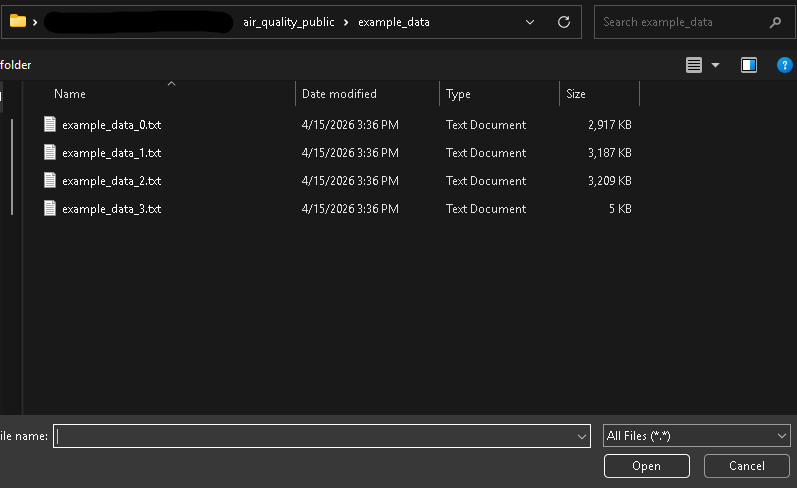

# **Air Quality Analyzer**

This application analyzes air quality log files for complete and reliable data. 


## **Description**

### Background
Researchers at the Center for Energy Development and Health are studying the air quality to which individuals are exposed, especially in the developing world. Participants wear devices that monitor air quality for a set period in which the device tracks particulate matter and location data. It also measures environmental metrics such as temperature and device metrics such as battery power. The data is stored in raw log files. 

### What this program does
This application ingests log files from those devices, cleans and processes the data, flags completeness issues and sensor incongruencies, and displays the results through an interactive visual dashboard.

**Note**: Personally identifiable information in the example datasets are scrubbed to protect the privacy of participants. 

### Impact
Researchers can quickly determine if a study ran short, if the device died or malfunctioned, and if any variables were measured out of an expected range. This helps determine the completeness, accuracy and trustworthiness of the study results. Researchers can also use the program for exploratory analysis of the data to understand what the participants’ air quality is like in their daily life.


## **Demo**







## **Prerequisites**
- Python 3.10 or higher
- Git


## **Installation**

1. Clone this repository:
```bash
   git clone https://github.com/cmason2394/air-quality-analyzer.git
   cd air-quality-analyzer
```

2. Create and activate a virtual environment (recommended):
```bash
   # Mac/Linux
   python -m venv .venv
   source .venv/bin/activate

   # Windows
   python -m venv .venv
   .\.venv\Scripts\Activate.ps1
```

3. Install dependencies:
```bash
   pip install -r requirements.txt
```


## **How to Use**

1. Run app.py:
```bash
   python app.py
```

2. Navigate to the local address shown in the terminal (usually called `http://127.0.0.1:8050/`) and open in your browser:


3. To explore the app without your own data, click the button on the landing page and use a csv file in the `example_data/` folder:



4. Interact with the page:
- **Table**: Hide/display variables in the table. Scroll down or across the table to see values. Hover over the column headings to see a short description of the heading.
- **Scatterplot**: Radio button to select the way time is displayed on the x-axis (local time, UTC time, or sample time). Dropdown selection to view different device metrics on the y-axis. Selecting device metrics automatically displays for how long that metric was outside of its expected range and a row in the summary statistics table. This tells researchers how reliable and accurate the sensor data is.


## **Features**
- Interactive dashboard
- Function that automatically checks completeness of data
- Function that checks for accuracy of data


## **Built With**
- Python 3.10
- Pandas
- Plotly
- Dash


## **Future Features**

- **More QA/QC checks**: a function that alerts researchers to long periods where the device read 0, or the exact same value, indicating possible sensor failure. 
- **Participant compliance**: feature that determines if participants wore their air quality monitoring devices throughout the study period.
- **Data engineering**: load multiple log files at the same time, aggregate the data, and store in a database.
- **Visualizations for air quality data**: scatterplot of particulate matter concentration and an air quality heat map.


## **License**
MIT License — see [LICENSE](LICENSE) for details.


## **Contributing**
Open to feedback and suggestions. Feel free to open an issue.


## **Acknowledgments**
Thanks to my mentor, [Dr. Christian L'Orange](https://www.engr.colostate.edu/me/faculty/dr-christian-lorange/), for guiding me through this project. 